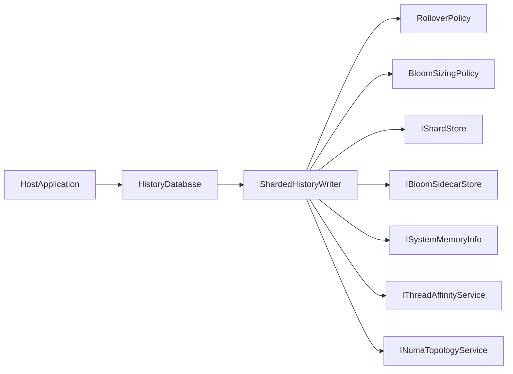

# HistoryDB

`HistoryDB` is a high-performance, generation-based, sharded history library for deduplicating 128-bit content hashes at very high write rates.

It is optimized for backend workloads where low-latency membership checks and sustained append-heavy ingestion are critical.

## What the library does

- Stores hashes in memory-mapped shard files using open addressing.
- Routes writes to shard-specific single-reader queues for concurrency safety and throughput.
- Uses Bloom sidecars to accelerate negative lookups across retained generations.
- Supports proactive generation rollover to avoid long probe paths under pressure.
- Includes optional background scrub and warm-up workflows for data hygiene and Bloom trust recovery.
- Supports optional thread affinity / NUMA-aware pinning for locality-focused deployments.

## Core Concepts

### Generation

A generation is a set of shard files (`0000.dat`..`00ff.dat` for 128 shards) plus Bloom sidecars (`0000.idx`..`00ff.idx`) under one generation folder named as 5-digit lowercase hexadecimal (`00000`..`fffff`, for example `00001`).

New writes target the active generation. Older generations remain queryable until retention retires them.

### Shard

A shard is a fixed-size memory-mapped hash table (`IShardStore`) with:

- 128-bit hash key (`hashHi`, `hashLo`)
- optional payload fields (`serverHi`, `serverLo`)
- probe-limit and load-factor protections

### Bloom sidecar

Each shard can have a Bloom sidecar that accelerates `Exists(...)` by skipping shard probes when membership is impossible.

## Public API

The public API is intentionally small:

- `HistoryDatabase(...)` (initialization)
- `bool HistoryLookup(string messageId)`
- `bool HistoryAdd(string messageId, string serverId)`
- `bool HistoryExpire(string messageId)`
- `int HistoryExpire(string[] messageIds)`
- `void HistorySync()`
- `int HistoryWalk(ref long position, out HistoryWalkEntry entry, int flags = 0)`

Performance tuning methods:

- `SetBloomCheckpointInsertInterval(ulong inserts)`
- `SetRolloverThresholds(ulong usedSlotsThreshold, int queueDepthThreshold, long aggregateProbeFailuresThreshold)`
- `SetSlotScrubberTuning(int samplesPerTick, int intervalMilliseconds)`

## Configuration

Use `HistoryWriterOptions` with nested option groups:

- `BloomOptions`
- `RolloverOptions`
- `SlotScrubberOptions`
- `AffinityOptions`

Minimum required setting:

- `RootPath`

## Quick Start

```csharp
using Microsoft.Extensions.Logging;

ILogger? logger = null; // Provide ILogger in real host apps.
HistoryDatabase db = new(
    rootPath: @"C:\historydb",
    shardCount: 128,
    slotsPerShard: 1UL << 22,
    maxLoadFactorPercent: 75,
    logger: logger);

bool inserted = db.HistoryAdd("<message-id@host>", "7b136f3d-eeb7-4777-95f4-b9e6eeec40ea");
bool exists = db.HistoryLookup("<message-id@host>");
db.HistoryExpire("<message-id@host>");
db.HistorySync();
```

## Architecture Overview



## Operational Notes

- **Durability model:** hash state lives in memory-mapped shard files; Bloom sidecars are best-effort accelerators.
- **Hashing model:** public `messageId` and `serverId` strings are internally hashed with MD5 and stored as 128-bit values.
- **Expire model:** expiration is managed explicitly by API calls and applied by lookup/walk logic.
- **Backpressure:** Bloom checkpoint persistence queue is bounded; drops are logged.
- **Logging:** structured logs use `Microsoft.Extensions.Logging` with source-generated `[LoggerMessage]` methods.
- **Fallback logger:** when no `ILogger` is provided, logging falls back to `System.Diagnostics.Trace`.

## Performance Characteristics

- Single-reader shard queues reduce lock contention on write paths.
- SIMD probing is used in shard probing hot paths when supported.
- Generation retention avoids full-table rewrites while allowing bounded historical lookup scope.
- Optional affinity pinning can improve locality for shard writer and maintenance workers.

### Observed benchmark results (HisBench)

The following results were observed on the current project configuration using `HisBench` with:

- `shards=128`
- `slots-per-shard=4194304` (~128 MiB per shard data file)
- `queue-capacity=1000000`
- `add-forks=8`, `lookup-forks=8`

These are empirical runs from this repository and are intended as directional reference points, not hard guarantees.

#### Sustained random-ID ingest + lookup

- Command profile: `--add-count 50000000 --lookup-count 50000000 --random-msgids`
- Insert throughput: ~**361k inserts/sec**
- Lookup throughput: ~**361k lookups/sec**
- Insert latency: p99 ~**17-21 us**
- Lookup latency: p99 ~**3.5-6.9 us**
- Health counters: `FullFails=0`, `ProbeFails=0`, `QueueApprox=0`

#### Restart warmup run (same load + `--restart-test`)

- Command profile: above + `--restart-test`
- Effective throughput over full run:
  - ~**290k inserts/sec**
  - ~**435k lookups/sec** (includes restart lookup phase)
- Insert latency: p99 ~**17.7 us**
- Lookup latency: p99 ~**3.5 us**
- Restart warmup timeline stabilized in low-microsecond range quickly after reopen.

#### Duplicate-dominated profile (small logical keyspace)

- Command profile: `--dataset-size 1000000` (non-random IDs)
- Representative observed run:
  - `Duplicates detected=50000000`
  - `Inserted=0` (duplicate-path dominated by design for this scenario)
  - Lookup throughput: ~**991k lookups/sec** (near **1M ops/sec**)
  - Lookup latency: p99 ~**2.6 us**
  - Engine health counters remained clean (`FullFails=0`, `ProbeFails=0`)
- Results show high duplicate detection and low successful inserts by design.
- This profile measures duplicate-path behavior and lookup speed, not sustained unique-ingest capacity.

### Interpreting these numbers

- `failed` insert counts in bench output can represent duplicate outcomes, not only capacity failures.
- Capacity pressure should be inferred primarily from engine counters (`FullFails`, `ProbeFails`) and queue pressure, not from duplicates alone.
- For comparable runs, use a fresh history directory per benchmark scenario.

## Build

```bash
dotnet build HistoryDB.csproj -c Release
```
